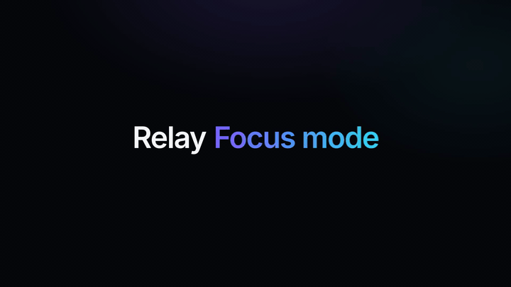

# React Launch Video

A Claude Code plugin for launch videos of your React app: short, cinematic videos in the style of Linear, Vercel and
Framer launches, rendered in [Remotion](https://www.remotion.dev) from your app's **real** components instead of a
redrawn mockup. It does CLIs too. It is not for Vue, Svelte, Angular or plain HTML.

It gives Claude a proven method (storyboard first, reading-time holds, overlapping handoffs, a camera that moves then
holds still), a starter kit of scene components and scripted quality gates that a render has to pass before it counts
as done. A second skill reviews a reel against the same standards.



That reel is built from `evals/fixtures/relay-web`, the small React app in this repo, and rendered by the plugin with
no hand editing ([full quality MP4](docs/demo-relay-web.mp4)). The product page is
[wingleung.github.io/react-launch-video](https://wingleung.github.io/react-launch-video).

## Install

In Claude Code:

```
/plugin marketplace add wingleung/react-launch-video
/plugin install react-launch-video@react-launch-video
```

That is `plugin@marketplace`, and both are called `react-launch-video`.

You also need **Node.js 22.18 or later** and **ffmpeg** on your PATH. Ask Claude to run the doctor
(`/react-launch-video:create run the doctor`) and it prints the install command for your OS when something is missing.
Remotion is installed per reel and downloads its own headless browser on the first render, so the first one is slower.

**What it costs.** Remotion is free for individuals, non-profits and companies with up to 3 employees. A for-profit
company with more than 3 employees needs a
[Remotion Company License](https://github.com/remotion-dev/remotion/blob/main/LICENSE.md). The fixture reel below takes
20 to 30 minutes. A real codebase takes longer, mostly in the one-time component split.

| Skill                        | Use it for                                                                     |
| ---------------------------- | ------------------------------------------------------------------------------ |
| `/react-launch-video:create` | Plan, build, render and verify a reel of your app or CLI                       |
| `/react-launch-video:review` | Review an existing reel or Remotion project and get ranked findings with fixes |

Claude also picks them up on its own when you ask for a promo video, launch reel or feature teaser.

## Try it before you point it at your product

Clone this repo and run the plugin against the fixture inside it. Nothing in your own code is touched, and you get a
finished reel to judge the method by:

```bash
git clone https://github.com/wingleung/react-launch-video && cd react-launch-video
```

Then, in Claude Code from that directory:

```
/react-launch-video:create a launch video of the Relay inbox and the settings dialog, in evals/fixtures/relay-web
```

That takes **20 to 30 minutes**, most of it unattended. It is the cheapest way to decide whether the output is worth
the longer first run on a real codebase.

## Using it on your product

Open Claude Code in your product's repo and ask for what you want:

```
/react-launch-video:create a 20 second launch video of our issue inbox and the command palette
```

Plain English works too ("make me a launch video of the settings page").

What happens next:

1. **It reads your product** and asks what the reel should say, then writes a storyboard: beats, timings, easings,
   which data is real and which is a placeholder. Read that storyboard, it is where changes are cheap.
2. **It makes your components renderable**: where a page fetches its own data, it splits it into a display-only view
   that takes its state as props, and checks your typecheck, tests and build before and after.
3. **It builds a reel package** next to your product (`reel/` by default) and renders drafts, reviewing frames as it
   goes.
4. **It runs the gates** and keeps iterating until they pass, reporting which gate still fails if it cannot.
5. **You get** `reel.mp4` (1920x1080), `storyboard.md` and the frames it reviewed.

A real product takes longer than the fixture, and the time goes into getting it to render rather than into the motion.
Most of a run is unattended, but stay for step 2, which is the one that edits your components. Ask for motion blur at
the end ("render the final with motion blur"). It multiplies render time, so it is not used during iteration.

### What it changes in your repo

- **It adds** a reel package (its own `package.json` and `node_modules`, Remotion pinned).
- **It may edit your components**: a page usually has to be split into a display-only view that takes its state as
  props, so it can be rendered frame by frame. The split is mechanical and the skill verifies your typecheck, tests
  and build still pass, but start from a clean git tree so you can read the diff.
- **It does not** upload or send your product, your reel or your data anywhere. It does download npm packages and
  Remotion's headless browser. Remotion itself reports render usage to remotion.pro only when a Remotion license key
  is configured, which the plugin never does. See [SECURITY.md](SECURITY.md).

## What it covers

- **React web apps.** The reel imports your real components, split into display-only views, and renders them frame by
  frame. What ships is what the video shows.
- **CLIs.** The terminal session is recreated from the CLI's own source: its strings, colours and prompts, traced
  through the code path that actually runs.

Other stacks (Vue, Svelte, Angular, plain HTML, native apps) are out of scope. The skill says so and stops, rather
than redrawing your product by hand.

## What you get in a reel

- A title card that recedes as the product rises in front of it, numbered feature captions and an end card, all held
  for their reading time (characters ÷ 17 + 0.5s, measured from fully settled).
- A camera that pushes in on what matters, computed from measured bounds, and holds perfectly still while text is read.
- Frame-perfect determinism: no CSS transitions, clocks or randomness leaking into the render.
- Optional band-free motion blur for the final render.

Every rule is sourced in the create skill's `references/pacing.md`.

## Quality gates

These run on every render, and a failing one means another pass rather than a caveat in the report. The skill runs all
six through a single `gates.mjs` command, so a round of iteration is one invocation rather than six.

| Gate                   | Fails when                                                                                                                                                   |
| ---------------------- | ------------------------------------------------------------------------------------------------------------------------------------------------------------ |
| `check-video.mjs`      | wrong resolution or length, no fade from or to black, an empty stage mid-reel                                                                                |
| `edge-scan.mjs`        | a border rests inside the action-safe margin, or content runs off the frame                                                                                  |
| `easing-inventory.mjs` | an animated value does not have the easing the storyboard says it has                                                                                        |
| `claims.mjs`           | a number a comment or a doc states about the timing is not what the code does                                                                                |
| `fonts.mjs`            | a font comes from a machine's font folder or the network (`@remotion/google-fonts` included), or a family named in CSS or a JSX `fontFamily` is never loaded |
| `lightness.mjs`        | the product's lightness is not what the kit was told, so the outro is mistuned                                                                               |

The runner also refuses to start on a reel that was never really finished, an unedited storyboard template or the
kit's own placeholder colours, which takes milliseconds instead of failing after a twenty minute render. It runs
`easing-inventory`, `claims`, `fonts` and `lightness` with `--strict`, so a package with no motion call, no claim, no
loaded font or a product it cannot find in the frame fails instead of passing with nothing to check.

These are tools rather than gates, and pass or fail nothing:

| Tool                     | In skill | Does                                                                                 |
| ------------------------ | -------- | ------------------------------------------------------------------------------------ |
| `contact-sheet.mjs`      | `create` | builds the frame sheets and crops the review is done on                              |
| `doctor.mjs`             | `create` | checks this machine has Node and ffmpeg with the right filters                       |
| `render-motion-blur.mjs` | `create` | renders the final with band-free motion blur                                         |
| `add-music.mjs`          | `create` | adds a music track without re-encoding the video, padding a short track with silence |
| `reading-time.mjs`       | `review` | works out how long a piece of on-screen text has to be held                          |

The kit adds two more that run when the composition loads, so a render fails in seconds instead of after an hour:
`assertStillWhileReading` throws when the camera moves while text is being read, and `assertReadingTime` throws when
a caption is held for less time than it takes to read.

## Troubleshooting

| Symptom                                      | Cause and fix                                                                                                                                                          |
| -------------------------------------------- | ---------------------------------------------------------------------------------------------------------------------------------------------------------------------- |
| The doctor reports a missing tool            | Install it with the command it prints, then open a new terminal so the PATH is picked up                                                                               |
| Motion blur render fails on a missing filter | Remotion's bundled ffmpeg has no `tmix`. Install a system ffmpeg and make sure it is first on the PATH                                                                 |
| Styles missing in the render                 | Utility CSS (Tailwind, UnoCSS) has to be generated over the reel and your components before each render, see the skill's step 4                                        |
| Icons or colours missing, nothing else       | A class name assembled at runtime is invisible to the utility-CSS scanner. Write the full name as a literal                                                            |
| The product picks its widest layout          | A media query measures the composition, not the window drawn around the product. Override the breakpoint in the reel's CSS                                             |
| Text renders in a fallback font              | Fonts must be loaded through `@remotion/fonts` from your product or a licensed package, not a stylesheet link                                                          |
| Frames differ between renders                | Something is not derived from the frame: a clock, `Math.random`, a CSS transition or an async effect. The storyboard's determinism table lists how each is neutralised |
| A gate fails and the reel looks fine         | Read the gate's output before overriding it. It reports times, so crop those frames and look at full resolution                                                        |

## Updating and removing

```
/plugin update react-launch-video
/plugin uninstall react-launch-video
```

Installed copies only update when the version in `plugin/.claude-plugin/plugin.json` changes. See
[CHANGELOG.md](CHANGELOG.md) for what moved.

## Licensing

This plugin is MIT licensed (see [LICENSE](LICENSE)). It is an independent project, not affiliated with or endorsed by
Remotion or the React project. Remotion and React are trademarks of their owners.

**Remotion has its own licence.** It is free for individuals, non-profits and for-profit organisations with up to 3
employees. A for-profit company with more than 3 employees needs a Remotion Company License. Read the terms in
[Remotion's LICENSE.md](https://github.com/remotion-dev/remotion/blob/main/LICENSE.md) before using this at work. The
plugin states this before it installs anything.

Fonts in a reel must come from your product or a licensed package such as `@fontsource`, never copied out of your
system font folder or another app. The skill enforces this.

## Evals

`evals/` holds three test cases and the fixtures they run against: a small React app, a small CLI and a deliberately
flawed reel for the review skill. See `evals/README.md` for how to run them with and without the plugin.

## Contributing

Issues and pull requests are welcome. Keep changes to the method sourced (a reference, a measurement or a rendered
before and after) and run the gate scripts on any change to the kit. Start with
[CONTRIBUTING.md](CONTRIBUTING.md), and [CODE_OF_CONDUCT.md](CODE_OF_CONDUCT.md) applies here.
